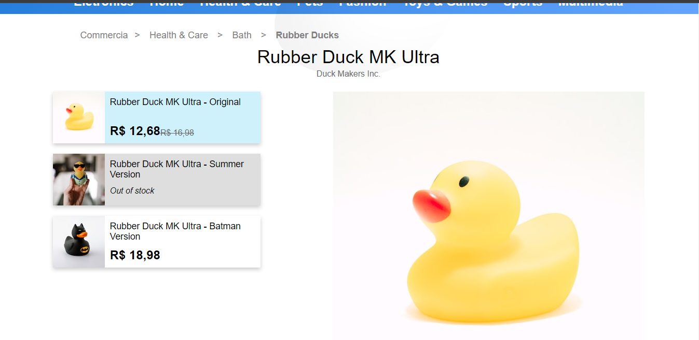

# Web Scraper com fetch API e cheerio.

## Um simples coletor para o seguinte site 
https://infosimples.com/vagas/desafio/commercia/product.html

### Como funciona?

#### O programa extrai dados desse produto e os salva de modo estruturado em um arquivo no formato JSON.

#### O formato é como neste exemplo:
- title -> nome do produto : string
- brand -> nome da marca: string
- categories -> categorias do produto : string
- description -> descrição do produto: string
- skus -> lista de objetos que são variações do produto : array\<Object\>
- properties -> lista de objetos que são propriedades do produto : array\<Object\>
- reviews -> lista de objetos onde cada um é um feedback de um cliente : array\<Object\>
- reviews_average_score -> média das avaliações do produto : float 
- url -> a URL na qual foi feita a requisição : string 